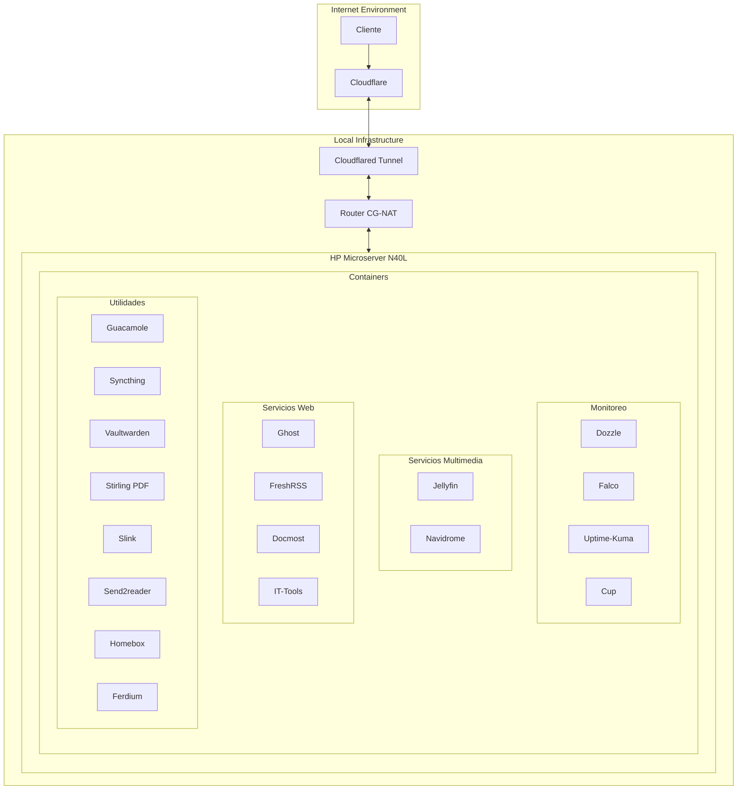

# Self-hosted personal services - HP Microserver N40L

## 📌 Overview
- Model: HP Microserver N40L
- Location: Santiago - Chile
- Active containers: ~29

## 🔧 Technical Specifications
- Operating System: [Arch BTW](https://archlinux.org/)
- CPU: AMD Turion™ II Neo N40L (2012)
  - Instruction Set: x86-64-v1
- RAM: 4GB
- Storage: 2TB
- Network: 300MB/s

## 🌐 Network Topology

## 🔒 Security
**Network Security**
- Cloudflare Tunnel for secure remote access
- CG-NAT protected network
- End-to-end encryption via Cloudflare

**Domain Management**
- Cloudflare managed domains
- SSL/TLS encryption
- DNS configuration through Cloudflare Dashboard

## 🛠 Deployed Services
**Monitoring**
- Dozzle - Container log viewer
- Falco - Security monitoring
- Uptime-Kuma - Service uptime monitoring
- Cup - Container updates monitor

**Multimedia Services**
- Jellyfin - Media server
- Navidrome - Music streaming

**Web Services**
- Ghost - Publishing platform -> [Read my post](https://ghost.deathgabox.work/)
- FreshRSS - RSS feed aggregator
- Docmost - Documentation platform
- IT-Tools - Developer utilities

**Utilities**
- Guacamole - Remote access gateway
- Syncthing - File synchronization
- Vaultwarden - Password management
- Stirling PDF - PDF manipulation
- Slink - Photo storage
- Send2reader - Kobo book sender
- Homebox - Home inventory manager
- Ferdium - Service aggregator

## 📦 Container Management
**Containerization**
- Docker for container runtime
- Docker Compose for service orchestration
- Local volume management for persistence

## Extra
- Base install on my [Dotfiles Repo](https://github.com/DeathGabox/Dotfiles)
- Inspired on [Atareo Self Hosted Repo](https://github.com/atareao/self-hosted)

## Hardware Limitation
### Old CPU Architecture Constraints
This server runs on an older AMD Turion™ II Neo N40L processor, which only supports the x86-64-v1 instruction set. This leads to several compatibility issues with modern applications.

#### Known Incompatibilities
1. **Applications requiring x86-64-v2 or newer instruction sets:**
   - [Grimoire](https://github.com/goniszewski/grimoire/issues/126)
     * Current workaround: Running on a separate modern laptop
   
   - [MySQL 8 Oracle](https://github.com/docker-library/mysql/issues/1055)
     * Current workaround: Using [mysql-oraclelinux8](https://hub.docker.com/_/mysql/tags?name=oraclelinux8) image
